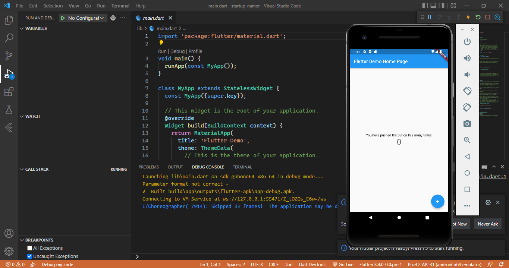
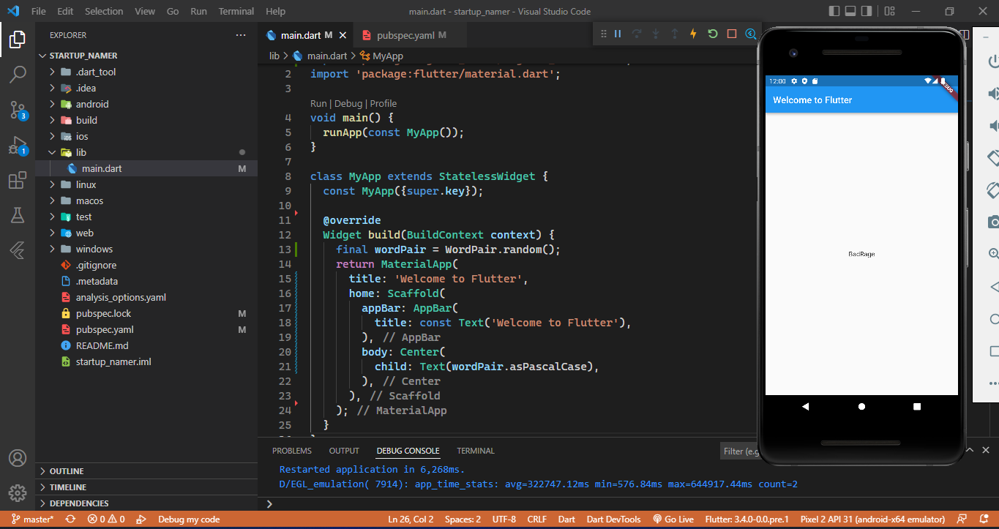
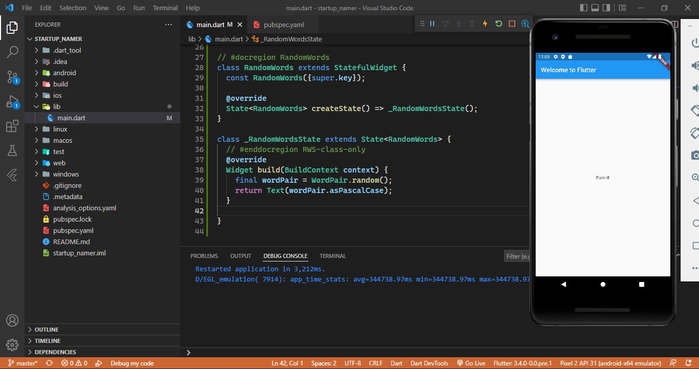
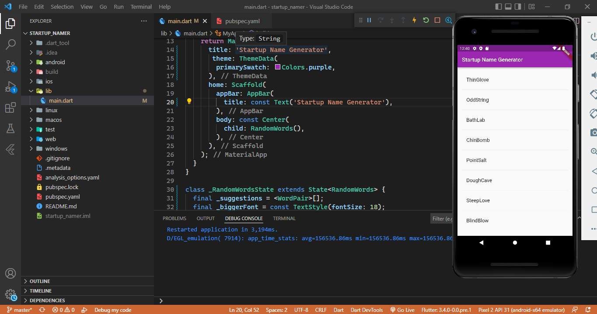
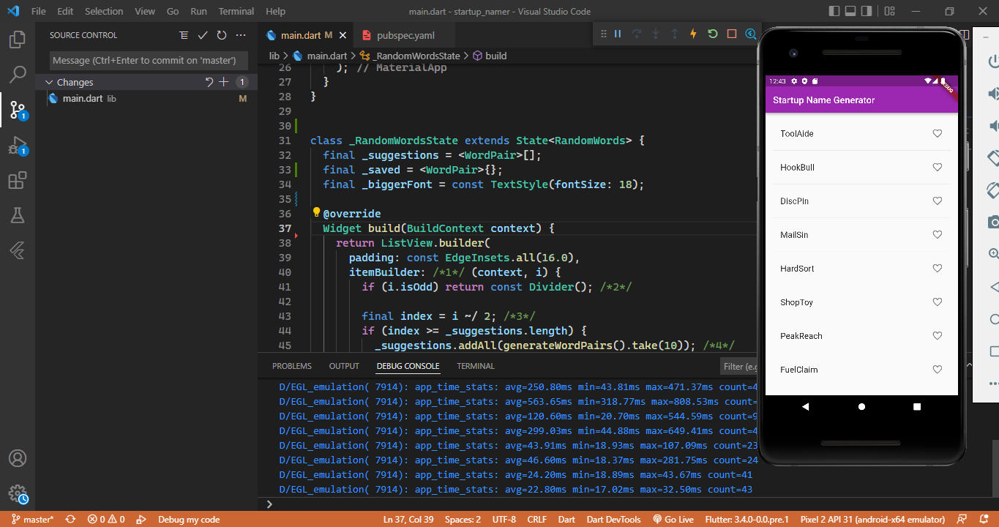

# startup_namer

A new Flutter project.

## Create the starter Flutter app
Pada praktikum ini membuat project flutter, ketika di run terdapat hasil hello word seperti gambar di bawah ini.

## Use an external package
Pada praktikum ini mengunakan package english_words yang berisi beberapa ribu kata bahasa Inggris. yang dikonfigurasi pada file pubspec.yaml. setelah berhasil di pub get maka packege tersebut bisa di import pada file lib main.dart, sehingga ketika di run terdapat hasil seperti gambar di bawah ini.

## Add a stateful widget
Pada paraktikum ini,  menambahkan widget stateful, RandomWords, yang membuat State kelasnya, _RandomWordsState. setelah itu akan menggunakan RandomWordssebagai  di dalam MyAppwidget stateless yang ada, sehingga ketika di run terdapat hasil seperti gambar di bawah ini.

## Create an infinite scrolling ListView
Pada Praktikum ini, pada kelas _RandomWordsState  menampilkan liat daftar kata random. daftar kata tersebut ditampilkan dalam ListViewwidget, sehingga ketika di run terdapat hasil seperti gambar di bawah ini.

## Add Icons
Pada Praktikum ini, menmpilkan daftar kata tersebut dalam bentuk ListViewwidget yang terdapat icon disamping kata, sehingga ketika di run terdapat hasil seperti gambar di bawah ini.

